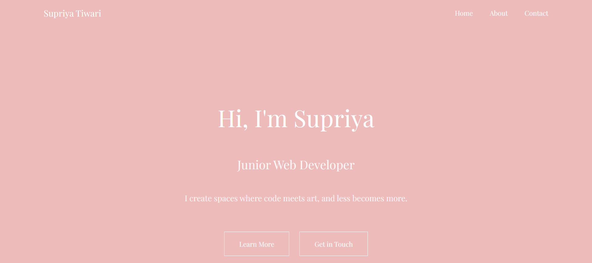

# Supriya Tiwari's Personal Portfolio

## Project Objective
This project is a personal portfolio designed to showcase my experience as an API Analyst, my transition into web development, and my passion for minimalist design. The website aims to be simple, clean, and responsive, providing visitors with an easy way to learn about my skills and contact me.

## Screenshot


## Tech Requirements
- HTML5
- CSS3
- JavaScript (ES6 Modules)
- Google Fonts (Playfair Display)
- Node.js and npm (to install required node_modules)

## How to Install/Use
1. Clone this repository to your local machine:
   ```bash
   git clone https://github.com/Shanaya-1981/personal-portfolio
   ```
2. Navigate to the project directory:
   ```bash
   cd personal-portfolio
   ```
3. Install the required node modules:
   ```bash
   npm install
   ```
4. Start the project:
   ```bash
   npm start
   ```

## Author
Supriya Tiwari

[Visit my portfolio](https://shanaya-1981.github.io/personal-portfolio/)

## Reference
This project was created as part of [CS5610 Project 1] coursework.

## Video Demonstration
[Link to video](YOUR_VIDEO_LINK_HERE)

## Generative AI Usage
This project used **Claude Sonnet 4.5** (by Anthropic) accessed via claude.ai on October 1, 2025 for assistance in the following areas:

1. **Understanding CSS Flexbox Layout**
   - **Prompt:** "How do I create a responsive skills grid using Flexbox?"
   - **Outcome:** Learned justify-content, align-items, and flex-wrap properties

2. **Implementing ES6 Modules and Dynamic Greeting**
   - **Prompt:** "Help me implement a time-based greeting function using ES6 modules"
   - **Outcome:** Created original JavaScript functionality with proper module exports

3. **Debugging Layout and Spacing Issues**
   - **Prompt:** "Why is my navigation not showing properly? How do I fix spacing between hero sections?"
   - **Outcome:** Fixed flexbox alignment and margin/padding issues
